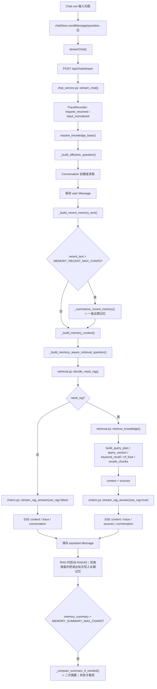
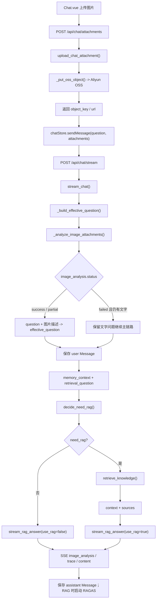
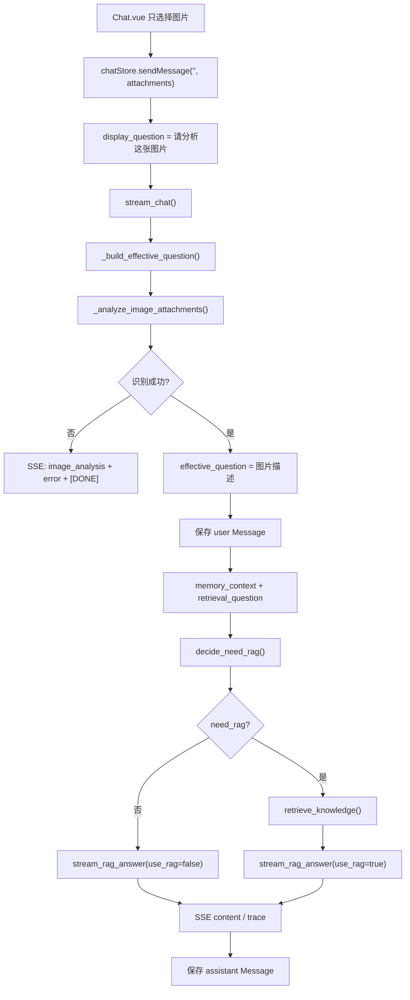
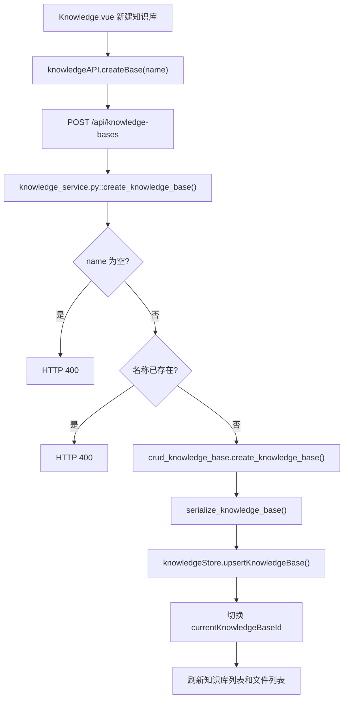
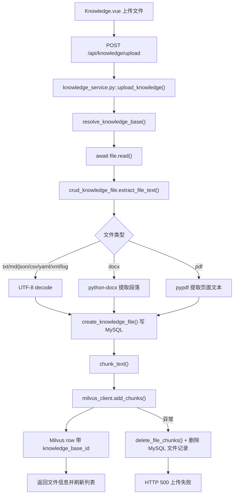

# PROJECT_FLOW_DIAGRAM

这份文档只画当前真实链路。聊天 RAG 主链路已经收束到 `rag.retrieval.retrieve_knowledge()`，不再经过 Agent 或 LangChain Tool 包装。

主要模块：

- 前端聊天：`src/views/Chat.vue`、`src/stores/chat.js`、`src/api/chat.js`
- 后端聊天：`backend/service/chat_service.py`
- RAG 检索与生成：`backend/rag/retrieval.py`、`backend/rag/rerank.py`、`backend/rag/chains.py`、`backend/rag/llm.py`
- 记忆与图片：`backend/rag/memory_service.py`、`vision_service.py`
- 知识库：`backend/service/knowledge_service.py`、`backend/crud/knowledge_file.py`、`backend/rag/milvus_client.py`

## 1. 纯文字问答

共用主链路仍是 `Chat.vue -> chatStore.sendMessage() -> streamChat() -> /api/chat/stream -> stream_chat()`。区别只在后端内部：RAG gate 决定是否检索；需要检索时直接进入 `retrieve_knowledge()`，再把上下文交给生成链。

## 2. 文字 + 图片问答

图片只是前置分支。识别成功后，它会合并成文本问题进入同一条聊天主链路。

## 3. 纯图片问答

纯图片场景只有在图片识别失败且没有文字问题时提前结束；否则会复用完整聊天闭环。

## 4. 创建知识库

前端负责刷新和切换视图，后端负责重名校验和默认知识库回退。

## 5. 上传文件入库

入库仍是 MySQL 元数据先落库，再按 `file_id` 替换写入 Milvus；向量写入失败会回滚文件记录和已写入 chunk。
